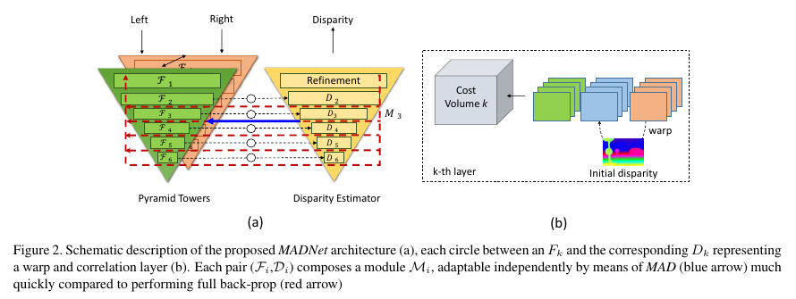

# TensorFlow 2 / Keras Subclassed Implementation of MADNet
## Note:
This code has been archived, no bug fixes or features will be added. The subclassed method was abandoned due to poor optimization. The MADNet Keras Functional API method is now the preferred TensorFlow 2 / Keras method. Please see the following repository for the Functional approach: [madnet-deep-stereo-with-keras](https://github.com/ChristianOrr/madnet-deep-stereo-with-keras).

## Introduction
MADNet is a deep stereo depth estimation model. Its key defining features are:
 1. It has a light-weight architecture which means it has low latency.
 2. It supports self-supervised training, so it can be conveniently adapted in the field with no training data. 
 3. It's a stereo depth model, which means it's capable of high accuracy.


This code is an implementation of MADNet with TensorFlow 2 / Keras Subclassed API. The original implementation in TensorFlow 1 can be found here: [Original TensorFlow 1 Code](https://github.com/CVLAB-Unibo/Real-time-self-adaptive-deep-stereo). The research paper for this model can be found here: [Real-time self-adaptive deep stereo](https://arxiv.org/abs/1810.05424). This code doesn't include the MAD++ adaptation method. The MAD adaption method is available with some limitations detailed below.


| [CVPR paper](https://arxiv.org/abs/1810.05424) | [CVPR video](https://www.youtube.com/watch?v=7SjyzDxmCY4) | [CVPR_Live_Demo](https://www.youtube.com/watch?v=4O-7OzVYAeU) |

| [TPAMI paper](https://arxiv.org/pdf/2007.05233.pdf) | [TPAMI video](https://www.youtube.com/watch?v=YnPGbQE2dLQ) |



**Abstract**:

Deep convolutional neural networks trained end-to-end are the undisputed state-of-the-art methods to regress dense disparity maps directly from stereo pairs. However, such methods suffer from notable accuracy drops when exposed to scenarios significantly different from those seen in the training phase (e.g.real vs synthetic images, indoor vs outdoor, etc). As it is unlikely to be able to gather enough samples to achieve effective training/ tuning in any target domain, we propose to perform unsupervised and continuous online adaptation of a deep stereo network in order to preserve its accuracy independently of the sensed environment. However, such a strategy can be extremely demanding regarding computational resources and thus not enabling real-time performance. Therefore, we address this side effect by introducing a new lightweight, yet effective, deep stereo architecture Modularly ADaptive Network (MADNet) and by developing Modular ADaptation (MAD), an algorithm to train independently only sub-portions of our model. By deploying MADNet together with MAD we propose the first ever realtime self-adaptive deep stereo system.


If you use this code please cite: 
```
@InProceedings{Tonioni_2019_CVPR,
    author = {Tonioni, Alessio and Tosi, Fabio and Poggi, Matteo and Mattoccia, Stefano and Di Stefano, Luigi},
    title = {Real-time self-adaptive deep stereo},
    booktitle = {The IEEE Conference on Computer Vision and Pattern Recognition (CVPR)},
    month = {June},
    year = {2019}    
}

@article{Poggi2021continual,
    author={Poggi, Matteo and Tonioni, Alessio and Tosi, Fabio
            and Mattoccia, Stefano and Di Stefano, Luigi},
    title={Continual Adaptation for Deep Stereo},
    journal={IEEE Transactions on Pattern Analysis and Machine Intelligence (TPAMI)},
    year={2021}
}

```

## Requirements
This software has been tested with python 3.9 and tensorflow 2.7. All required packages can be installed using pip and requirements.txt

```
pip3 install -r requirements.txt
```

## Pretrained Weights for Network
TF1 pretrained weights for both DispNet and MADNet available [here](https://drive.google.com/open?id=1GwGxBOFx-NlUo9RAUgPlgPvaHCpGedlm). TF2 subclassed pretrained weights are not available.

## Data Preparation
For the training and inferencing scripts to function the data needs to be prepared in the following way. For supervised training the left rectified, right rectified and groundtruth is needed. Optionally for validation, the rectified left, rectified right and groundtruth can also be used during supervised training. Note that Bad3 and EPE metrics can only be provided if groundtruth is available. Each file needs to be placed in its own folder with the same filename, since the left, right and groundtruth is matched based on the order they are placed in the folder. For unsupervised training / inferencing the same method is used but only left and right images are needed. If you would like to load the images using a different method (like from a CSV file) you will need to update the StereoDatasetCreator class with your own code in the preprocessing.py script.   
  

## MADNet Training
Two training options are available, supervised training (with groundtruth disparity) and unsupervised training (no groundtruth disparity). Its recommended to either use pretrained weights (not available yet) or perform supervised training on the model before performing unsupervised training on your dataset. Alternatively fine-tuning on the model can be performed while inferencing. Examples for both training methods are listed below:
1. Supervised Training
   ```bash
   python3 subclassed_train.py \
   --train_left_dir /path/to/left/train_images \
   --train_right_dir /path/to/right/train_images \
   --train_disp_dir /path/to/right/train_images \
   -o /path/to/output/trained_model \
   --height 480 \
   --width 640 \
   --batch_size 1 \
   --num_epochs 500 \
   --epoch_steps 1000 \
   --save_freq 1000
    
   {OPTIONAL}
   --val_left_dir /path/to/left/val_images \
   --val_right_dir /path/to/right/val_images \
   --val_disp_dir /path/to/right/val_images \
   --checkpoint_path /path/to/pretrained/model 
   ```
2. Un-Supervised Training
   ```bash
   python3 subclassed_train.py \
   --train_left_dir /path/to/left/train_images \
   --train_right_dir /path/to/right/train_images \
   -o /path/to/output/trained_model \
   --height 480 \
   --width 640 \
   --batch_size 1 \
   --num_epochs 500 \
   --epoch_steps 1000 \
   --save_freq 1000
    
   {OPTIONAL}
   --checkpoint_path /path/to/pretrained/model
   ```
## Inferencing / Online Adaptation
Once you have trained your model or downloaded a pretrained model you can perform inferencing. Inferencing can be performed using full MAD (adapt all modules), MAD (adapt 1-5 modules), or inferencing only. Examples of performing these three options are shown below:

1. Full MAD
   ```bash
   python3 subclassed_inferencing.py \
   --left_dir /path/to/left/rectified_images \
   --right_dir /path/to/right/rectified_images \
   --mad_pred \
   --num_adapt 6 \
   -o /path/to/save/adapted_model \
   --checkpoint_path /path/to/pretrained/model \
   --height 320 \
   --width 1216 
   ```
2. MAD
   ```bash
   python3 subclassed_inferencing.py \
   --left_dir /path/to/left/rectified_images \
   --right_dir /path/to/right/rectified_images \
   --mad_pred \
   --num_adapt 1 \
   -o /path/to/save/adapted_model \
   --checkpoint_path /path/to/pretrained/model \
   --height 320 \
   --width 1216      
   ```
2. Inferencing Only
   ```bash
   python3 subclassed_inferencing.py \
   --left_dir /path/to/left/rectified_images \
   --right_dir /path/to/right/rectified_images \
   --checkpoint_path /path/to/pretrained/model \
   --height 320 \
   --width 1216      
   ```

## Limitations
The training and inferencing is not graph executable, so needs to have eager_mode = True. The model also does not support exporting to TensorFlow saved_model.pb or keras .h5 because it is a subclassed model. Exporting to tflite is also not possible due to not being graph compatable.